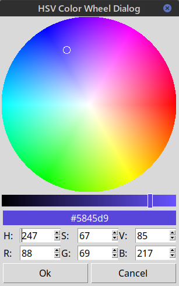

# HSV Color Wheel Dialog

This Python package implements a modal color selection dialog based on the HSV (Hue, Saturation, Value) color model. It provides an intuitive graphical interface where users can pick colors by clicking on a circular color wheel and adjusting brightness with a slider. The dialog is designed to be easily integrated into any Python Tkinter application that requires color input, such as graphic editors, data‑visualisation tools, or custom GUI utilities.

__Installation:__

```
pip install https://github.com/mdjogatovic/hsv_cw_dialog/releases/download/v0.1.0/hsv_cw_dialog-0.1.0-py3-none-any.whl
```



__Usage:__

```python
import tkinter as tk
from hsv_cw_dialog import show_hsv_cw_dialog

root = tk.Tk()

def get_color(parent):
    color = show_hsv_cw_dialog(parent,title="HSV Color Wheel Dialog",color=parent["bg"])
    if color:
        parent["bg"] = color["hex"]

b = tk.Button(root, text="Select Color", command=lambda: get_color(b))
b.pack()

tk.mainloop()
```
